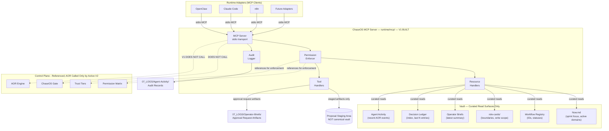
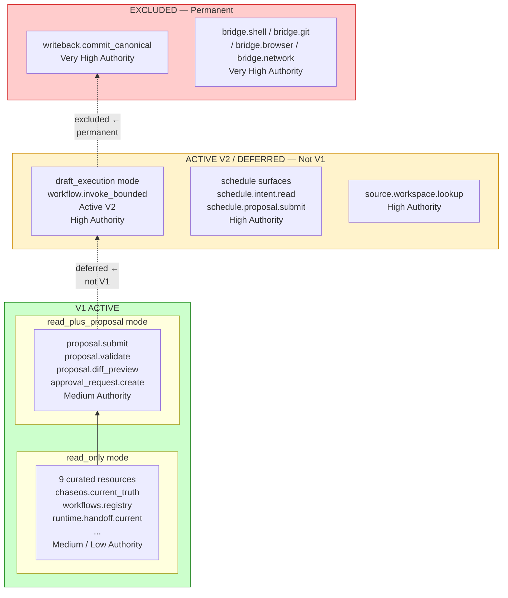
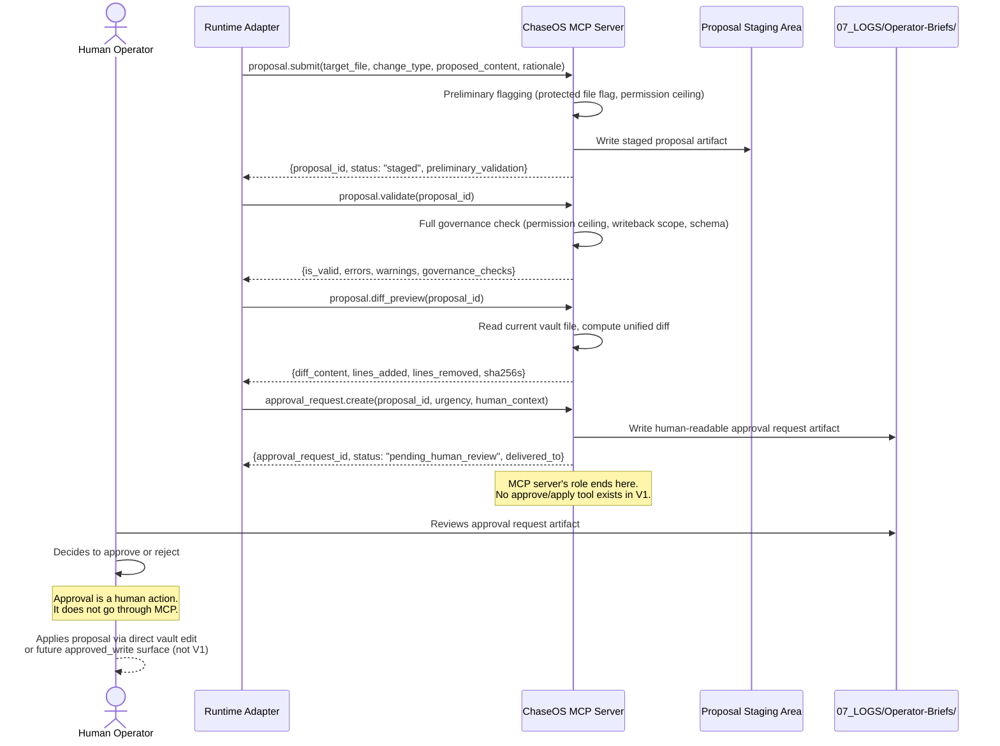
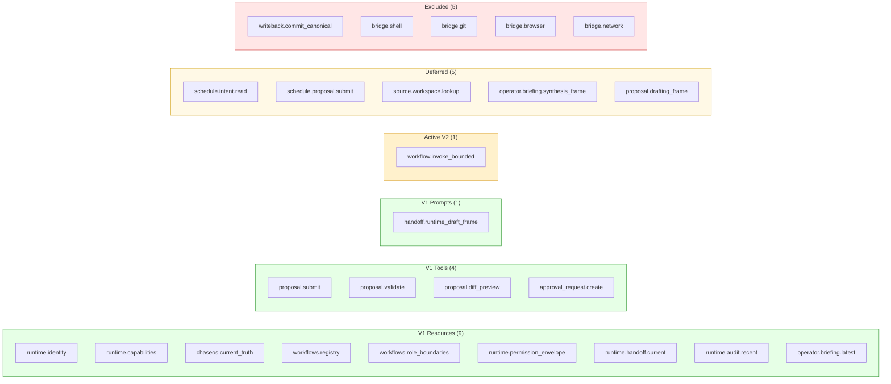
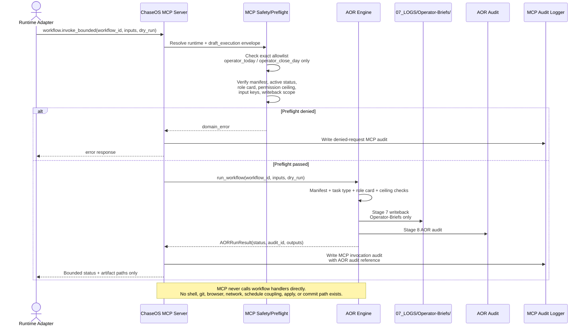

# ChaseOS MCP Diagrams

> Architecture diagrams for the ChaseOS Runtime MCP V1 plus the Pass 6B active V2 `workflow.invoke_bounded` surface.
>
> All diagrams are architecture-faithful. V1 diagrams reflect the live V1 design. The invocation diagram reflects the active V2 implementation shape.
> Planned, deferred, and excluded surfaces are explicitly labeled where relevant.
>
> Diagrams are written in Mermaid syntax. They render in Obsidian with the Mermaid plugin enabled.

---

## Diagram 1 — V1 System Context

**What this shows:** Where the ChaseOS MCP V1 server sits relative to runtime adapters, the vault, and the existing control plane. Honest about what V1 calls and what it explicitly does not call.

**Key reads:**
- Runtime adapters connect via stdio. The MCP transport is local-first.
- The permission enforcer references the Permission Matrix and Trust Tiers but does not call them at runtime — it applies the rules that were encoded from those documents during implementation.
- The V1 MCP server explicitly does NOT call the ChaseOS Gate or AOR Engine. These are separate surfaces with separate authorities.
- The active V2 invocation flow in Diagram 5 is the only designed exception, and it routes to AOR only through `workflow.invoke_bounded`.
- Tool handlers write only to the proposal staging area and approval request artifact path. The audit logger writes audit records. No MCP path writes canonical vault state.

---

## Diagram 2 — Authority Ladder

**What this shows:** The authority tiers of the V1 design — from lowest to highest — with clear marking of what is V1-active, deferred, and excluded.

**Key reads:**
- V1 ceiling is `read_plus_proposal`. No execution authority. No canonical write authority.
- `workflow.invoke_bounded` is active V2 only and remains unavailable in V1 modes.
- The remaining deferred tier is named and bounded — it is not "things we haven't gotten to yet," it is "things we've consciously parted from V1 with specific reasons."
- The excluded tier is permanent. Moving anything from excluded requires a Decision Ledger entry.

---

## Diagram 3 — Proposal Flow Sequence

**What this shows:** The complete lifecycle of a vault write proposal through the MCP surface. Emphasizes where human review occurs and that the MCP server has no role after approval request creation.

**Key reads:**
- The sequence shows 4 MCP calls. That is the full proposal surface.
- After `approval_request.create`, the MCP server has no further role. It waits for the next request.
- Human approval is not an MCP tool call. It is a human action, not an automated step.
- "Apply" does not exist in V1. The sequence shows it as a future surface, not an immediate next step.

---

## Diagram 4 — V1 Surface Map Overview

**What this shows:** All 25 named surfaces in a single view, grouped by V1 status. Intended as a quick-reference reference card and for portfolio/credibility use.

**Surface counts:** 14 V1 active | 1 active V2 | 5 deferred | 5 excluded | 25 total named

---

## Diagram 5 - Active V2 Workflow Invocation Flow

**What this shows:** The active `workflow.invoke_bounded` flow implemented in Pass 6B. It is not active in V1 modes. The flow is AOR-routed, allowlist-bound, and draft-safe/log-safe only.

**Key reads:**
- First release allows exactly `operator_today` and `operator_close_day`.
- The MCP preflight gate is strict, but AOR remains the execution authority.
- AOR owns workflow execution and AOR audit; MCP owns the MCP request audit through the server/envelope layer.
- A successful MCP response returns status and artifact paths only. Full generated brief text is not returned through MCP.
- If MCP completion audit fails after AOR returns, MCP must return `system_error(workflow_invocation_audit_failed)` and must not re-run the workflow.

---

## Diagram Usage Notes

**For Pass 3 (file/module design):** Diagram 1 (V1 system context) is the primary reference for understanding which vault paths each module reads and which external systems it does or does not call.

**For Pass 4 (scaffold/build):** Diagram 3 (proposal flow sequence) is the primary reference for understanding the order of operations in the tool handler pipeline.

**For governance review:** Diagram 2 (authority ladder) is the primary reference for evaluating whether a proposed addition to V1 is within the intended authority ceiling.

**For Pass 6B / invocation implementation:** Diagram 5 is the primary reference for the active V2 `workflow.invoke_bounded` flow.

**For external communication:** Diagram 4 (surface map overview) is suitable for portfolio and architecture presentation contexts. It is honest about V1 scope and makes the deferred/excluded distinction visible.

---

*Graph links: [[Vault-Map]] · [[ChaseOS-MCP-Server]] · [[ChaseOS-MCP-Surface-Map]] · [[ChaseOS-MCP-Workflow-Invocation]] · [[ChaseOS-MCP-Safety-Modes]] · [[ChaseOS-MCP-Guardrails]] · [[ChaseOS-MCP-Data-Contracts]]*

*ChaseOS-MCP-Diagrams.md - v1.2 | Created: 2026-04-19 | Updated: 2026-04-21 Pass 6B (active V2 workflow invocation flow implemented; V1 diagrams preserved)*
