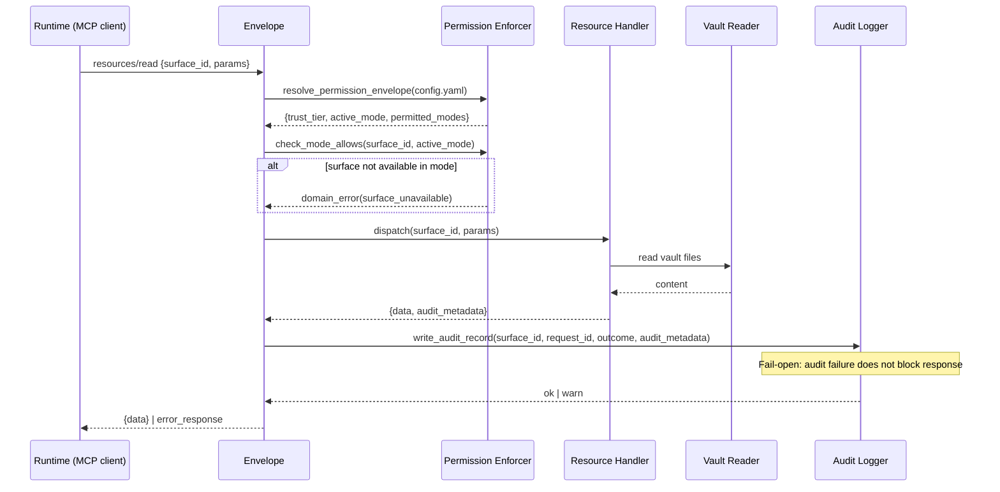
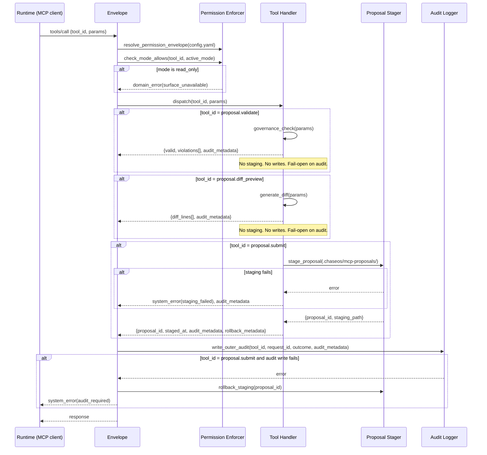
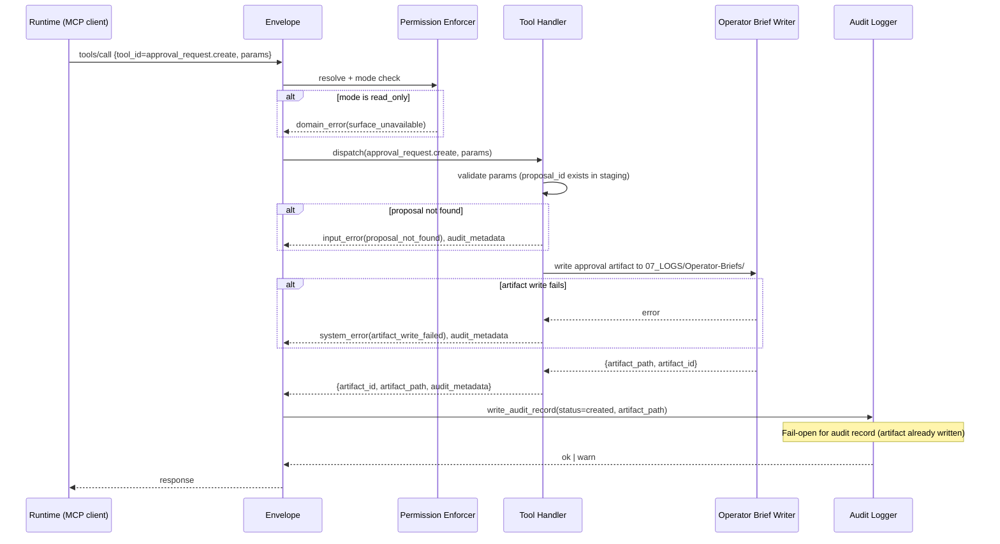
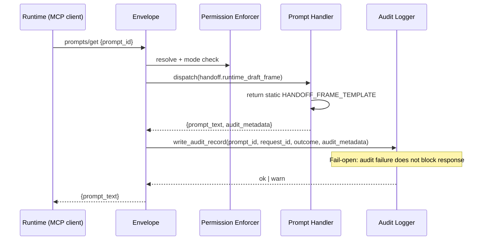
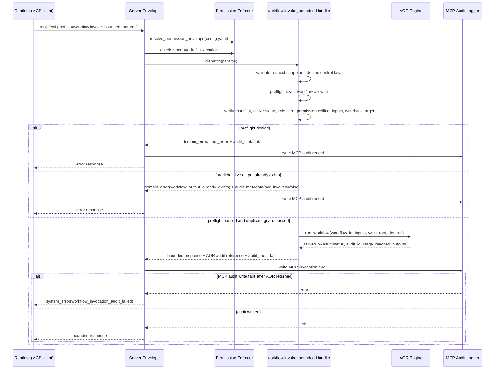

# ChaseOS MCP Internal Flow

> Module-design-level internal request handling flows for the ChaseOS Runtime MCP server.
> This document covers: what happens inside the server on each request class, where safety checks occur, where the audit write happens, and what boundaries to AOR and Gate are enforced.

---

## Overview

The MCP server receives requests via stdio transport. Each request is classified into one of five flow types:

| Flow type | Triggered by | V1 status |
|-----------|-------------|-----------|
| Read request | Resource read (MCP `resources/read`) | V1 active |
| Proposal flow | Tool call: proposal.submit, proposal.validate, proposal.diff_preview | V1 active (read_plus_proposal only) |
| Approval request flow | Tool call: approval_request.create | V1 active (read_plus_proposal only) |
| Prompt request flow | Prompt fetch: handoff.runtime_draft_frame | V1 active |
| Bounded workflow invocation | Tool call: workflow.invoke_bounded | Active V2 (draft_execution only) |

All five flows share the same outer envelope: permission resolution -> mode check -> surface dispatch -> audit write -> response.

Audit ownership is centralized in this outer envelope. Surface handlers return structured audit metadata (`files_read`, `files_written`, outcome detail, and any rollback metadata needed for `proposal.submit`). Handlers do not call `MCPAuditLogger` directly.

---

## Shared Outer Envelope

Every request passes through this sequence before reaching surface-specific logic:

```text
Incoming request (stdio JSON-RPC)
  |
  +- 1. Parse + validate request shape
  |     +- malformed -> input_error response (no audit write)
  |
  +- 2. Resolve permission envelope
  |     +- reads config.yaml -> runtime_id, trust_tier, permitted_modes, active_mode
  |     +- config missing or invalid -> system_error (fail-closed)
  |
  +- 3. Safety mode check
  |     +- is the requested surface available in active_mode?
  |     +- no -> domain_error(surface_unavailable) (no staging, no writes)
  |
  +- 4. Dispatch to surface handler
  |     +- handler executes and returns response + audit metadata
  |
  +- 5. Audit write (synchronous, before response)
  |     +- server/envelope calls MCPAuditLogger
  |     +- writes to 07_LOGS/Agent-Activity/ regardless of handler outcome
  |     +- audit failure on read flows: fail-open (log failure, continue)
  |     +- audit failure on proposal.submit: fail-closed (envelope rolls back staging, return system_error)
  |     +- audit failure after AOR returned for workflow.invoke_bounded: fail-closed with workflow_invocation_audit_failed
  |
  +- 6. Return response to caller
```

---

## Flow 1: Read Request

Triggered by any of the 9 V1 resource reads (runtime.identity, chaseos.current_truth, workflows.registry, etc.).



**Key rules:**
- Vault reads are file-system reads only; no subprocess calls, no Gate calls.
- `chaseos.current_truth` uses the safe default subset (`sprint_focus`, `current_phase`, `active_domains`) when no `fields` parameter is supplied.
- Additional `chaseos.current_truth` fields require an explicit `fields: [...]` request.
- If a source file does not exist, return `domain_error(source_unavailable)`; do not return partial data silently.
- Audit failure on read: logged internally, response continues.

---

## Flow 2: Proposal Tool Flow

Triggered by `proposal.submit`, `proposal.validate`, or `proposal.diff_preview`. Available in `read_plus_proposal` and `draft_execution`.



**Key rules for proposal.submit (fail-closed):**
- Staging succeeds first; then the envelope writes the audit record. If audit fails, the envelope rolls back staging and returns an error.
- A staged proposal with no audit record must not exist.
- Proposal staging writes only to `.chaseos/mcp-proposals/`; no vault paths, no Gate calls.
- Protected-file proposals may be staged. `proposal.submit` sets `governance_flags.is_protected_file=true`; `proposal.validate` surfaces the governance violation.
- Proposal is not applied anywhere by the MCP server; it is an artifact to be reviewed.

**Key rules for proposal.validate / proposal.diff_preview (fail-open):**
- These are analysis-only tools; they produce no artifacts.
- Audit failure: logged internally, response continues.

---

## Flow 3: Approval Request Flow

Triggered by `approval_request.create`. Available in `read_plus_proposal` and `draft_execution`. This is the only MCP-native tool that writes a human review artifact to `07_LOGS/Operator-Briefs/`.



**Key rules:**
- Artifact write is fail-closed: if the Operator-Briefs artifact cannot be written, return error; do not return success without the artifact.
- Audit record is fail-open after artifact write: the artifact exists and is the primary deliverable.
- The only vault path this tool may write to is `07_LOGS/Operator-Briefs/`; exactly this path, not parent, not sibling.
- It does not write audit records directly; the server/envelope calls `MCPAuditLogger`.
- No Gate call; the MCP server does not invoke Gate. Gate governs canonical writes done by operators.
- The approval artifact is human-readable; no automated apply path exists in V1.

---

## Flow 4: Prompt Request Flow

Triggered by prompt fetch for `handoff.runtime_draft_frame`. Available in `read_plus_proposal` and `draft_execution`.



**Key rules:**
- Prompt serving is static/template-only.
- The prompt handler does not read `runtime.handoff.current`, does not assemble live handoff context, and does not load hidden vault context.
- Live contextual prompt assembly is a future design item, not V1.
- Audit failure: fail-open.

---

## Flow 5: Bounded Workflow Invocation

Triggered by `workflow.invoke_bounded`. Available only in `draft_execution`.



**Key rules:**
- The only allowed workflow IDs are `operator_today` and `operator_close_day`.
- The handler calls AOR only through `runtime.aor.engine.run_workflow()`; it does not call workflow handlers directly.
- Schedule IDs, handler names, module names, paths, shell/git/browser/network controls, approval flags, apply, and commit fields are denied before AOR is called.
- Non-dry-run invocations deny before AOR when the predicted first-release Operator-Briefs artifact already exists; this returns `workflow_output_already_exists` and writes an MCP error audit with `aor_invoked=false`.
- The MCP response includes status, AOR audit ID, stage reached, artifact paths, files written, `dry_run`, `canonical_write: false`, `audit_reconciliation`, and `retry_guidance`.
- The MCP response does not include full generated brief text, raw vault content, protected file content, or apply/commit instructions.
- AOR writes AOR audit records. MCP writes MCP audit records through the server/envelope only.

---

## Safety Mode Check Location

Safety mode enforcement is in the **outer envelope**, not inside handlers.

```text
Envelope layer:
  permission_enforcer.check_mode_allows(surface_id, active_mode)
    -> reads surface_mode_map (defined in modes.py)
    -> raises ModeViolationError if surface not permitted in active mode
    -> caught by envelope -> returns domain_error before handler is called
```

Handlers never check mode directly. A handler that runs has already passed mode enforcement.

---

## Permission Envelope Resolution Point

Permission envelope is resolved **once per request**, at the start of the outer envelope, before any dispatch.

```text
permission_enforcer.resolve(vault_root)
  -> reads runtime/mcp/config.yaml
  -> returns PermissionEnvelope(runtime_id, trust_tier, permitted_modes, active_mode)
  -> stored in request context for the duration of the request
  -> not re-read mid-request
```

If config.yaml is missing or invalid: `system_error`, fail-closed; no request proceeds without a valid envelope.

---

## Audit Write Point

Audit records are written **synchronously, before the response is returned**, in the outer envelope after handler completion.

```text
Timing:  handler completes -> audit write -> response sent
Location: 07_LOGS/Agent-Activity/
Naming:  {timestamp}__mcp__{surface_id}__{request_id[:8]}.json
Fail behavior: per surface class (see Audit Policy doc)
```

Audit writes are never deferred or backgrounded. The caller may observe slightly higher latency on `proposal.submit` and `workflow.invoke_bounded` because the audit write must complete before success is confirmed.

Handlers never write audit files and never call `MCPAuditLogger`. They return structured audit metadata to the envelope only.

---

## No-Call Boundaries

The MCP server does not call the following systems under any circumstances in V1. Pass 6B adds one active V2 exception for AOR routing.

| System | Boundary | Reason |
|--------|----------|--------|
| ChaseOS Gate | DOES NOT CALL | Gate governs canonical writes; MCP V1 makes no canonical writes |
| AOR engine | CALLED ONLY BY `workflow.invoke_bounded` | Active V2 exception; all other MCP surfaces do not call AOR |
| AOR workflow registry | DOES NOT CALL | workflows.registry resource reads from YAML files directly |
| Schedule loader | DOES NOT CALL | schedule surfaces are deferred from V1 |
| Subprocesses | DOES NOT SPAWN | No shell calls, no subprocess.run, no os.system |
| External network | DOES NOT REACH | MCP server is local-only; no outbound HTTP |

These are not policy preferences; they are module dependency rules enforced by the architecture. Importing `runtime.gate` into any MCP module is a dependency violation. Importing `runtime.aor.engine` is permitted only in `runtime/mcp/tools/workflow_invoke.py` for `workflow.invoke_bounded`.

---

## Failure Path Summary

| Request type | Audit fail behavior | Surface unavailable | Source file missing |
|--------------|--------------------|--------------------|---------------------|
| Resource read | Fail-open | domain_error | domain_error |
| proposal.validate | Fail-open | domain_error | N/A |
| proposal.diff_preview | Fail-open | domain_error | N/A |
| proposal.submit | Fail-closed (envelope rolls back staging) | domain_error | N/A |
| approval_request.create | Fail-open after artifact write | domain_error | input_error |
| Prompt fetch | Fail-open | domain_error | N/A |
| workflow.invoke_bounded | Fail-closed after AOR returns; duplicate live output denied before AOR with `workflow_output_already_exists` | domain_error | domain_error |
| Config missing | - | system_error (pre-dispatch) | - |

---

*Architecture doc - v1.2 | Phase 9 Pass 3A - MCP Documentation Consistency Cleanup | Pass 4 implementation live in `runtime/mcp/`; Pass 6B `workflow.invoke_bounded` flow added; Pass 6C duplicate-output guard documented*


*Graph links: [[Vault-Map]]*
