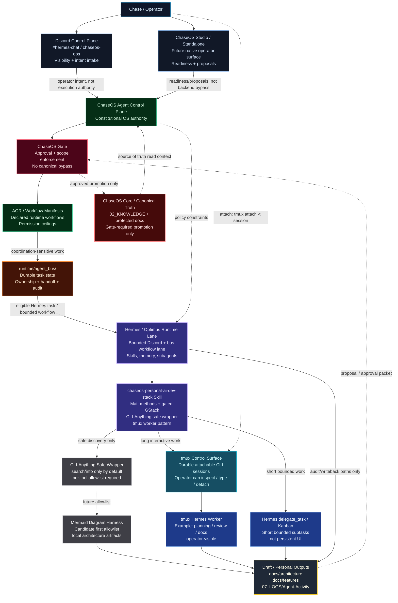

# ChaseOS Hermes + tmux + Agent Bus Architecture

This is the first personal-system architecture diagram for the AI-era developer stack. It explains how Hermes, tmux, the Agent Bus, ChaseOS Gate, and Discord Control Plane should work together without expanding Hermes into ChaseOS Core or bypassing ChaseOS governance.

Links: [[HERMES]] · [[Hermes-Runtime-Profile]] · [[06_AGENTS/Agent-Control-Plane|Agent Control Plane]] · [[06_AGENTS/Runtime-InterAgent-Coordination-Bus|Runtime Inter-Agent Coordination Bus]] · [[06_AGENTS/ChaseOS-Discord-Control-Plane|ChaseOS Discord Control Plane]] · [[02_KNOWLEDGE/AI-Agents/Personal-AI-Era-Developer-Stack|Personal AI Era Developer Stack]] · [[04_SOPS/Personal-AI-Dev-Stack-Development-Workflow-SOP|Personal AI Dev Stack Development Workflow SOP]]

## Diagram 1 — Operator-visible Hermes orchestration lane



## Plain-English readout

1. **Discord and Studio are operator surfaces, not authority engines.** They carry requests, summaries, approvals, and visibility.
2. **ChaseOS Agent Control Plane and Gate decide what can happen.** Hermes does not gain authority because a request arrived in Discord or because a tmux session exists.
3. **The Agent Bus is the machine coordination substrate.** Coordination-sensitive work becomes durable state under `runtime/agent_bus/`, not an ambient Discord loop.
4. **Hermes/Optimus executes only inside bounded lanes.** It can plan, review, document, draft, produce bus results, and write approved audit/handoff artifacts.
5. **tmux is the operator-visible terminal interface.** Hermes can start durable sessions; Chase can attach and supervise them directly.
6. **CLI-Anything is deny-by-default.** It is currently safe discovery only. A harness like Mermaid must be explicitly allowlisted before agents use it as an execution tool.
7. **Canonical ChaseOS Core remains protected.** Drafts, diagrams, handovers, and proposals can be created in personal/draft/audit lanes; promotion into canonical Core requires Gate approval.

## Operator tmux control instructions

List sessions:

```bash
tmux ls
```

Attach to a Hermes/tmux session:

```bash
tmux attach -t chaseos-dev-stack-demo
```

Detach without killing the session:

```text
Ctrl-b then d
```

Capture the latest visible pane output without attaching:

```bash
tmux capture-pane -t chaseos-dev-stack-demo -p | tail -80
```

Kill only a named demo/worker session when finished:

```bash
tmux kill-session -t chaseos-dev-stack-demo
```

Future supervised Hermes worker launch pattern:

```bash
tmux new-session -d -s chaseos-planning-worker -x 140 -y 42 'hermes -s chaseos-personal-ai-dev-stack'
tmux send-keys -t chaseos-planning-worker 'Use the ChaseOS Personal AI Era Developer Stack. Review the SOP and propose the next 5 automation upgrades. Do not write files. Do not use Codex. Do not use gstack browser/cookies/deploy. Ask before external side effects.' Enter
tmux attach -t chaseos-planning-worker
```

## README alignment notes

When this diagram is promoted into a README or operator guide, keep the framing simple:

- **ChaseOS is the OS/control plane.**
- **Discord/Studio are control surfaces.**
- **Agent Bus is machine coordination.**
- **Gate is permission and promotion enforcement.**
- **Hermes is a bounded runtime lane.**
- **tmux is the human-openable terminal window into durable agent sessions.**
- **Personal AI Dev Stack is personal-system methodology/tooling, not ChaseOS Core.**

## Next diagram set

Recommended follow-up diagrams:

1. **Whole ChaseOS system map** — Personal OS, vault, AOR, Gate, Agent Bus, Studio, Pulse, Discord, runtimes, Browser Operator, schedules, logs.
2. **ChaseOS request lifecycle** — request → classify → route → approve → execute/draft → audit → promote or archive.
3. **tmux worker lifecycle** — spawn → prompt → observe → intervene → capture → handover → kill/archive.
4. **ChaseOS Pulse suggestion cards** — task classification → Matt/GStack/CLI/tmux/browser-proof suggestions → approval states.
5. **Agent Tool Registry / CLI-Anything allowlist** — safe discovery → source audit → allowlist → scratch smoke test → production suggestion.
