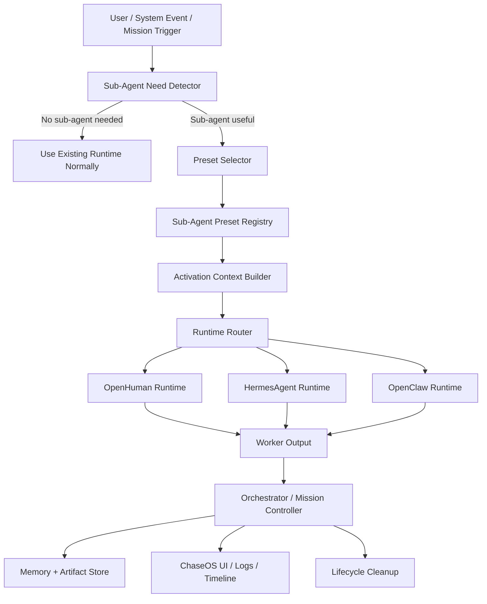

# ChaseOS Default Sub-Agent Presets & Task-Scoped Worker System

**Document status:** Product / architecture specification
**Intended location:** ChaseOS repository docs, architecture folder, or feature planning folder
**Feature name:** Default Sub-Agent Presets & Task-Scoped Worker System
**Primary goal:** Give ChaseOS a default system for spawning specialized sub-agent workers only when a task, mission, workflow, or planning mode actually needs them.

**Implementation status (2026-05-20):** PARTIAL. Passes 1-9 are implemented and
verified for preset files, schemas, registry/router/activation helpers, read-only
CLI list/show/validate/route-preview, approval-preview, guarded pending approval
request writing, read-only approval consumption dry-run, and immutable
approval-review decision artifact preview/write. Pass 7 adds a read-only
approval-consumption decision binding preflight that validates a pending request
plus a recorded approved decision and reports readiness for a future executor.
Pass 8 adds a guarded exact-once marker contract that can preview or write one
create-only consumption marker after exact request/decision/fingerprint binding.
Pass 9 adds an inert Agent Bus task packet preview after recorded marker
reservation, validating the request, decision, marker, selected bus runtime, and
strict no-write/no-dispatch execution constraints without enqueueing work. Full
approval/decision consumption, request/decision artifact mutation, Agent Bus task
write/enqueue, daemon start, runtime dispatch, Studio Approval Center
integration, and live sub-agent execution remain unbuilt.

---

## 1. Executive Summary

ChaseOS needs a default sub-agent preset/workflow system that works across its three autonomous runtime backends:

1. **OpenHuman**
2. **HermesAgent**
3. **OpenClaw**

Those three runtime backends are the only components that should be assumed to be resident or continuously available. The sub-agents are **not** always-running daemons. They are **task-scoped worker presets**: pre-designed instruction packs, policies, memory scopes, output contracts, and runtime preferences that ChaseOS can activate when a task requires deeper planning, specialist reasoning, parallel analysis, project testing, site operations, venture operations, or long-form workflow decomposition.

A good mental model is:

> The runtime backends are always alive. The sub-agents are not.
> Sub-agents are closer to structured `Claude.md`-style instruction files plus lifecycle rules than independent always-running processes.

When ChaseOS decides it needs specialist help, it creates a sub-agent activation context from a preset, routes it through the best runtime backend, gives it bounded tools and memory access, collects the output, persists only useful summaries/artifacts, and then tears down the sub-agent context.

This system should let ChaseOS ship with default “agent teams” for common workflows without wasting compute by keeping every worker alive at all times.

---

## 2. Core Principle

### 2.1 Only the runtime backends are always running

ChaseOS currently has three runtime backends:

```txt
OpenHuman
HermesAgent
OpenClaw
```

These should remain the continuously available execution engines.

The sub-agent system should not introduce a permanently running swarm of extra agents. Instead, it should introduce a **preset and activation layer** that tells the existing runtimes how to behave for a specific task.

### 2.2 Sub-agents are activated, not permanently hosted

A sub-agent should be treated as an on-demand worker context.

```txt
Sub-agent preset stored in repo / database
        ↓
ChaseOS determines task needs specialist worker
        ↓
Activation context is created
        ↓
Runtime router selects OpenHuman, HermesAgent, or OpenClaw
        ↓
Worker executes bounded task
        ↓
Output is collected and summarized
        ↓
Useful state is persisted
        ↓
Worker context is cleaned up
```

### 2.3 Sub-agents should be cheap by default

The default behavior should be conservative:

- Do not spawn sub-agents for simple requests.
- Do not spawn all workers in a preset automatically.
- Do not keep workers alive after their task is complete unless a mission explicitly requires a temporary session.
- Use planning heuristics before creating workers.
- Use one worker when one worker is enough.
- Use parallel workers only when the task actually benefits from parallel analysis.
- Persist compact summaries instead of full raw conversations whenever possible.

---

## 3. Feature Goals

The sub-agent feature should satisfy these goals:

1. **Provide default pre-designed sub-agent presets** for common ChaseOS workflows.
2. **Work across all three runtime backends**: OpenHuman, HermesAgent, and OpenClaw.
3. **Support multiple ChaseOS modes**, including Server Mode, Workspace Mode, Mission Mode, Venture Ops Mode, and Site Ops Mode.
4. **Avoid unnecessary compute usage** by making sub-agents task-scoped and activation-based.
5. **Use instruction-pack-style definitions**, similar in spirit to a `Claude.md` file, so workers can be pre-designed without running permanently.
6. **Allow ChaseOS to decide when a sub-agent is needed** based on task complexity, workflow type, risk, duration, and planning depth.
7. **Support orchestrated teams** where a CEO/planner/orchestrator agent can break down work and assign specialist workers.
8. **Support specialist workers** for marketing, product analysis, engineering, QA/testing, research, site operations, venture operations, and memory/reporting.
9. **Allow mode-specific adaptation** so the same underlying worker concept behaves differently in different ChaseOS modes.
10. **Support saved site profiles** without giving every sub-agent unnecessary account/session/tool access.
11. **Persist reusable outputs** such as summaries, artifacts, decisions, test results, and workflow state.
12. **Be easy for Codex or Claude Code to wire into the repository** using clear schemas, lifecycle rules, and implementation phases.

---

## 4. Non-Goals

This feature should **not** become:

1. A permanently running swarm of sub-agents.
2. A new runtime backend competing with OpenHuman, HermesAgent, or OpenClaw.
3. An uncontrolled autonomous execution layer where workers can freely use tools without policies.
4. A system that duplicates every runtime’s existing features.
5. A system that automatically spawns large numbers of agents for every request.
6. A system that stores full raw agent transcripts forever by default.
7. A system that lets sub-agents access every memory, site profile, credential, or tool without explicit policy.
8. A hardcoded workflow that cannot be extended or edited later.

---

## 5. Correct Mental Model

### 5.1 Runtime backend vs sub-agent

A **runtime backend** is an execution engine.

A **sub-agent** is a role-specific instruction and policy context that can be run through a backend.

```txt
Runtime backend:
  - OpenHuman
  - HermesAgent
  - OpenClaw
  - Always available
  - Owns execution loop/tooling/runtime behavior

Sub-agent:
  - Marketing Worker
  - Product Analysis Worker
  - QA Worker
  - Site Ops Worker
  - CEO Orchestrator
  - Not always running
  - Spawned only when useful
  - Mostly defined by instructions, policies, and output contracts
```

### 5.2 Sub-agents are instruction presets with lifecycle

A sub-agent preset should contain:

- Identity
- Role
- Responsibilities
- Operating instructions
- Runtime preferences
- Activation triggers
- Tool permissions
- Memory permissions
- Output format
- Failure behavior
- Compute limits
- Cleanup rules

It does **not** need to contain a permanently running process.

---

## 6. High-Level Architecture



### 6.1 Main components

```txt
SubAgentNeedDetector
  Decides whether a sub-agent should be activated.

SubAgentPresetRegistry
  Stores default and custom worker instruction packs.

SubAgentPresetSelector
  Chooses the best preset or team template for the task.

SubAgentActivationContextBuilder
  Converts a preset into a concrete task-scoped worker context.

SubAgentRuntimeRouter
  Chooses OpenHuman, HermesAgent, or OpenClaw for the worker.

SubAgentLifecycleManager
  Handles activation, running, pausing, resuming, failing, completing, and cleanup.

SubAgentTaskQueue
  Handles queued work, parallel work, retries, and long-running mission tasks.

SubAgentMemoryRouter
  Controls what each worker can read and write.

SubAgentToolPolicyEngine
  Controls what each worker can use, propose, or execute.

SubAgentOrchestrator
  Coordinates multi-worker missions and merges outputs.

SubAgentTelemetry
  Captures progress, outputs, cost, token usage, tool calls, failures, and summaries.
```

---

## 7. Lifecycle Model

Sub-agents should follow a bounded lifecycle.

```txt
Defined → Selected → Activated → Running → Completed → Persisted → Cleaned Up
```

Detailed lifecycle:

1. **Defined**
   - Preset exists as a markdown, YAML, JSON, TypeScript, or database-backed definition.

2. **Selected**
   - ChaseOS determines the current task needs this worker.

3. **Activated**
   - A task-specific activation context is created.
   - Runtime preference, tools, memory, budget, and output contract are resolved.

4. **Running**
   - The selected runtime backend executes the task using the worker’s instruction pack.

5. **Waiting for Approval**
   - Optional state for risky actions, external actions, account actions, destructive changes, deployments, or purchases.

6. **Completed**
   - Worker returns structured output.

7. **Persisted**
   - ChaseOS stores useful summaries, artifacts, decisions, diffs, reports, or test results.

8. **Cleaned Up**
   - Temporary context is discarded.
   - Worker is no longer consuming compute.

### 7.1 Lifecycle states

```ts
type SubAgentLifecycleState =
  | "defined"
  | "selected"
  | "activated"
  | "queued"
  | "running"
  | "waiting_for_approval"
  | "blocked"
  | "completed"
  | "failed"
  | "cancelled"
  | "expired"
  | "persisted"
  | "cleaned_up";
```

---

## 8. Activation Rules

The sub-agent system should only activate workers when ChaseOS has a good reason.

### 8.1 Good reasons to activate a sub-agent

Activate a sub-agent when one or more of these are true:

- The task requires **extensive planning**.
- The task crosses multiple domains, such as product, marketing, engineering, and operations.
- The task is part of **Mission Mode**.
- The task is part of **Venture Ops Mode**.
- The task involves **project testing**, QA, debugging, or code review.
- The task needs parallel specialist opinions.
- The task involves browser automation or saved site profiles.
- The task involves long-running server-side work.
- The task has high uncertainty and benefits from research or critique.
- The task has high risk and needs review before execution.
- The user explicitly asks for a specialist, team, worker, planner, or extensive planning.

### 8.2 Bad reasons to activate a sub-agent

Do not activate a sub-agent when:

- The user asks a simple question.
- The task can be handled directly by the active runtime.
- The worker would only restate obvious information.
- The cost of spawning the worker is higher than the expected benefit.
- The task does not require specialist behavior.
- The task requires a tool or profile the worker is not allowed to access.
- The mission budget has been exceeded.

### 8.3 Activation decision pseudocode

```ts
function shouldActivateSubAgents(input: TaskInput, context: ChaseOSContext): boolean {
  const complexity = estimateComplexity(input);
  const domains = detectDomains(input);
  const mode = context.currentMode;
  const risk = estimateExecutionRisk(input, context);
  const explicitRequest = detectsExplicitSubAgentRequest(input);
  const requiresTools = detectSpecializedToolNeed(input);
  const requiresPlanning = detectExtensivePlanningNeed(input);

  if (explicitRequest) return true;
  if (mode === "mission" && complexity >= 2) return true;
  if (mode === "venture_ops" && domains.length >= 2) return true;
  if (mode === "site_ops" && requiresTools.browserOrProfile) return true;
  if (requiresPlanning && complexity >= 2) return true;
  if (risk >= 3 && context.policies.requireReviewWorkers) return true;
  if (domains.length >= 3) return true;

  return false;
}
```

---

## 9. Compute-Efficiency Requirements

The sub-agent system must be designed to avoid runaway compute usage.

### 9.1 Compute controls

Each sub-agent activation should have a budget.

```ts
type SubAgentComputeBudget = {
  maxRuntimeMs?: number;
  maxIterations?: number;
  maxToolCalls?: number;
  maxTokens?: number;
  maxParallelWorkers?: number;
  priority?: "low" | "normal" | "high" | "critical";
  allowContinuation?: boolean;
};
```

### 9.2 Recommended default budgets

```txt
Simple specialist task:
  maxIterations: 2-4
  maxToolCalls: 3-8
  persistence: summary only

Extensive planning task:
  maxIterations: 4-8
  maxToolCalls: 5-15
  persistence: plan + decisions + artifacts

Mission worker:
  maxIterations: 6-12
  maxToolCalls: policy controlled
  persistence: task state + summary + artifacts

Site ops worker:
  maxIterations: bounded by workflow step count
  maxToolCalls: browser/tool policy controlled
  persistence: site profile-safe summary
```

### 9.3 Cost-saving behaviors

The implementation should prefer:

- Lazy activation.
- Small worker context windows.
- Summarized mission memory.
- Reusing preset instructions instead of regenerating role prompts.
- Sequential workers for most tasks.
- Parallel workers only when parallelism improves quality or speed.
- Early stopping when output contract is satisfied.
- Worker output compression before persistence.
- Explicit maximum worker count per mission.

### 9.4 Worker TTL

Every activated worker should have a TTL.

```ts
type SubAgentTTLPolicy = {
  expiresAfterMs: number;
  extendOnActivity: boolean;
  maxExtensions: number;
  cleanupStrategy: "discard" | "summarize_then_discard" | "persist_artifacts_then_discard";
};
```

Default behavior should be:

```txt
Complete task → summarize useful state → persist artifacts → destroy worker context
```

---

## 10. Preset Storage Model

Sub-agent presets should be stored as reusable definitions. They can be represented as markdown files with frontmatter, JSON, YAML, TypeScript objects, or database records.

For implementation simplicity, ChaseOS should start with **repo-local markdown/YAML instruction packs** and optionally compile them into runtime objects.

### 10.1 Recommended folder structure

```txt
chase-os/
  subagents/
    README.md
    presets/
      core/
        ceo-orchestrator.md
        planner.md
        researcher.md
        critic.md
        memory-curator.md
      engineering/
        architect.md
        implementation-worker.md
        debugger.md
        qa-tester.md
        docs-writer.md
      venture-ops/
        venture-ceo.md
        market-researcher.md
        marketing-worker.md
        product-analyst.md
        offer-funnel-worker.md
        analytics-worker.md
      site-ops/
        site-profile-worker.md
        browser-operator.md
        data-extraction-worker.md
        site-qa-worker.md
      server/
        monitor-worker.md
        scheduler-worker.md
        reporter-worker.md
    teams/
      default-mission-team.yaml
      default-workspace-team.yaml
      default-venture-ops-team.yaml
      default-site-ops-team.yaml
    schemas/
      subagent-preset.schema.json
      team-preset.schema.json
```

### 10.2 Markdown preset format

Each preset can look like this:

```md
---
id: marketing-worker
version: 1
name: Marketing Worker
description: Creates marketing strategy, content angles, UGC concepts, positioning, and campaign plans.
runtimePreferences:
  - HermesAgent
  - OpenHuman
modes:
  - mission
  - venture_ops
  - workspace
activation:
  triggers:
    - marketing_strategy
    - campaign_planning
    - content_creation
    - ugc_script_generation
  minComplexity: 2
tools:
  allowed:
    - web_research
    - document_generation
    - workspace_read
  denied:
    - destructive_file_write
    - credential_access
    - payment_actions
memory:
  read:
    - mission_summary
    - venture_profile
    - brand_profile
    - workspace_notes
  write:
    - marketing_plan
    - campaign_summary
    - content_ideas
compute:
  maxIterations: 5
  maxToolCalls: 8
  maxTokens: 12000
output:
  format: structured_markdown
  requiredSections:
    - Objective
    - Audience
    - Positioning
    - Strategy
    - Content Ideas
    - Risks
    - Next Actions
---

# Role

You are the Marketing Worker for ChaseOS.

# Operating Rules

- Stay focused on marketing strategy, positioning, messaging, content, and campaigns.
- Do not make product, engineering, or financial decisions unless explicitly asked.
- If the task needs data you do not have, request research or return assumptions clearly.
- Prefer practical execution plans over generic theory.
- Return structured output that another ChaseOS worker can consume.
```

---

## 11. TypeScript Data Model

The repository can use TypeScript interfaces similar to the following.

```ts
export type RuntimeBackendId = "OpenHuman" | "HermesAgent" | "OpenClaw";

export type ChaseOSMode =
  | "server"
  | "workspace"
  | "mission"
  | "venture_ops"
  | "site_ops";

export type SubAgentId = string;
export type MissionId = string;
export type TaskId = string;

export interface SubAgentPreset {
  id: SubAgentId;
  version: number;
  name: string;
  description: string;
  role: string;

  runtimePreferences: RuntimeBackendId[];
  modes: ChaseOSMode[];

  activation: SubAgentActivationPolicy;
  tools: SubAgentToolPolicy;
  memory: SubAgentMemoryPolicy;
  compute: SubAgentComputeBudget;
  lifecycle: SubAgentLifecyclePolicy;
  output: SubAgentOutputContract;

  instructions: string;
  tags?: string[];
  createdBy?: "system" | "user" | "workspace";
}

export interface SubAgentActivationPolicy {
  triggers: string[];
  minComplexity?: number;
  maxRiskWithoutApproval?: number;
  requiresExplicitUserApproval?: boolean;
  allowParallel?: boolean;
  allowLongRunning?: boolean;
}

export interface SubAgentToolPolicy {
  allowed: string[];
  denied: string[];
  requiresApproval?: string[];
}

export interface SubAgentMemoryPolicy {
  read: string[];
  write: string[];
  denied?: string[];
  summarizeBeforePersist?: boolean;
}

export interface SubAgentComputeBudget {
  maxRuntimeMs?: number;
  maxIterations?: number;
  maxToolCalls?: number;
  maxTokens?: number;
  maxParallelWorkers?: number;
  priority?: "low" | "normal" | "high" | "critical";
  allowContinuation?: boolean;
}

export interface SubAgentLifecyclePolicy {
  ttlMs: number;
  cleanupStrategy:
    | "discard"
    | "summarize_then_discard"
    | "persist_artifacts_then_discard";
  checkpointOnCompletion: boolean;
  checkpointOnFailure: boolean;
}

export interface SubAgentOutputContract {
  format: "structured_markdown" | "json" | "diff" | "report" | "artifact_bundle";
  requiredSections?: string[];
  jsonSchema?: unknown;
  artifactTypes?: string[];
}
```

---

## 12. Activation Context

A preset is static. An activation context is concrete.

```ts
export interface SubAgentActivationContext {
  activationId: string;
  presetId: SubAgentId;
  missionId?: MissionId;
  taskId: TaskId;
  parentAgentId?: string;

  mode: ChaseOSMode;
  objective: string;
  userIntent?: string;
  input: unknown;

  selectedRuntime: RuntimeBackendId;
  fallbackRuntimes: RuntimeBackendId[];

  resolvedInstructions: string;
  resolvedTools: SubAgentToolPolicy;
  resolvedMemory: SubAgentMemoryPolicy;
  resolvedCompute: SubAgentComputeBudget;
  outputContract: SubAgentOutputContract;

  createdAt: string;
  expiresAt: string;
  state: SubAgentLifecycleState;
}
```

The activation context should be the thing passed into OpenHuman, HermesAgent, or OpenClaw.

---

## 13. Runtime Routing

The runtime router should decide which backend receives the activated worker context.

### 13.1 Routing factors

The router should consider:

- Current ChaseOS mode.
- Worker preset runtime preferences.
- Required tools.
- Memory requirements.
- Browser/site profile requirements.
- Current runtime availability.
- Cost/load.
- Risk level.
- Whether the task needs human-facing reasoning or autonomous execution.
- Whether the task needs code/workspace access.
- Whether the task needs browser/site automation.

### 13.2 Example routing policy

```ts
function routeSubAgent(context: SubAgentActivationContext): RuntimeBackendId {
  const preferred = context.fallbackRuntimes.length
    ? [context.selectedRuntime, ...context.fallbackRuntimes]
    : [context.selectedRuntime];

  for (const runtime of preferred) {
    if (runtimeIsAvailable(runtime) && runtimeCanSatisfy(runtime, context)) {
      return runtime;
    }
  }

  return chooseBestAvailableRuntime(context);
}
```

### 13.3 Suggested runtime affinity

These affinities are guidance only. They should be adjusted to match the actual implementation and capabilities of each backend.

```txt
OpenHuman:
  Best for human-facing reasoning, approvals, interactive planning, communication, and tasks where user collaboration matters.

HermesAgent:
  Best for planning, research, analysis, structured reasoning, project decomposition, product analysis, and strategy work.

OpenClaw:
  Best for browser workflows, site operations, profile-aware actions, tool-heavy workflows, and web/session execution.
```

---

## 14. Orchestration Model

The system should support a default orchestrator worker, but the orchestrator should also be task-scoped.

### 14.1 CEO Orchestrator

The CEO Orchestrator is not always running. It is activated when a task needs multi-worker planning or coordination.

Responsibilities:

- Understand the mission objective.
- Break the objective into subtasks.
- Decide which workers are needed.
- Assign tasks to workers.
- Prevent duplicate work.
- Merge outputs.
- Resolve conflicts between worker recommendations.
- Request human approval when required.
- Produce the final mission plan or execution summary.

The CEO Orchestrator should **not** directly do every specialist task. Its job is to coordinate and synthesize.

### 14.2 Orchestrator instruction pattern

```txt
You are the task-scoped CEO Orchestrator for ChaseOS.
Your job is to decide whether specialist workers are needed, delegate bounded tasks, collect their outputs, and synthesize a final plan or result.
You must minimize compute by activating the fewest workers necessary.
You must not spawn workers for simple tasks.
You must preserve user intent, mode constraints, tool permissions, and memory boundaries.
```

### 14.3 Worker assignment example

```txt
User task:
  "Plan and validate a launch strategy for this new AI tool."

CEO Orchestrator activates:
  - Market Research Worker
  - Product Analysis Worker
  - Marketing Worker
  - QA/Critic Worker

CEO Orchestrator does not activate:
  - Browser Operator unless browsing/site actions are needed
  - Engineering Worker unless code implementation is needed
  - Scheduler Worker unless a long-running server task is needed
```

---

## 15. ChaseOS Mode Integration

The same sub-agent system should adapt to each ChaseOS mode.

---

### 15.1 Server Mode

Server Mode is for backend, long-running, scheduled, queued, or autonomous system tasks.

In Server Mode, sub-agents should be activated as **job workers**. They should not remain permanently alive after the job finishes.

Example use cases:

- Scheduled competitor monitoring.
- Periodic site checks.
- Report generation.
- Long-running research jobs.
- Async workflow steps.
- Retry/recovery tasks.
- Server-side mission continuation.

Server Mode workers should use:

```txt
- Queue-based activation
- Job IDs
- TTLs
- Retry policies
- Checkpoints
- Compact persistence
- Strict compute budgets
```

Example Server Mode flow:

```txt
Scheduled job triggers competitor scan
        ↓
Need detector selects Market Research Worker
        ↓
Runtime router chooses HermesAgent or OpenClaw depending on tools required
        ↓
Worker runs scan
        ↓
Reporter Worker summarizes result
        ↓
Summary is saved
        ↓
Worker contexts are cleaned up
```

Recommended Server Mode workers:

```txt
Scheduler Worker
Monitor Worker
Reporter Worker
Recovery Worker
Market Research Worker
Site QA Worker
Data Extraction Worker
```

---

### 15.2 Workspace Mode

Workspace Mode is for repo-local, project-local, file-aware, and development-oriented work.

Sub-agents in Workspace Mode should understand the current project context but should not receive unnecessary global memory or unrelated site profile access.

Example use cases:

- Codebase review.
- Architecture planning.
- Debugging.
- Test generation.
- Documentation.
- Refactor planning.
- Feature implementation breakdown.
- Project QA.

Recommended Workspace Mode workers:

```txt
Architect Worker
Implementation Worker
Debugger Worker
QA Tester Worker
Documentation Worker
Critic Worker
Memory Curator Worker
```

Example Workspace Mode flow:

```txt
User asks: "Test this project and find what is broken."
        ↓
ChaseOS activates QA Tester Worker
        ↓
QA Tester produces failure list and reproduction plan
        ↓
If fixes are requested, Implementation Worker is activated
        ↓
Critic Worker may review the patch
        ↓
Final summary is persisted to workspace notes
```

Workspace Mode memory policy:

```txt
Read:
  - current repo files
  - project notes
  - active mission summary
  - relevant prior decisions

Write:
  - test reports
  - implementation plans
  - patch summaries
  - docs updates

Deny by default:
  - unrelated site profiles
  - credentials
  - unrelated venture memories
```

---

### 15.3 Mission Mode

Mission Mode is goal-based orchestration.

In Mission Mode, the CEO Orchestrator is often useful, but it should still only activate when the mission is complex enough.

Example mission:

```txt
"Launch the landing page and validate it."
```

Possible worker activation:

```txt
CEO Orchestrator
  ├── Product Analysis Worker
  ├── Marketing Worker
  ├── Engineering Worker
  ├── QA Tester Worker
  └── Site Ops Worker
```

Mission Mode should support:

- Goal decomposition.
- Worker selection.
- Task graph creation.
- Parallel or sequential execution.
- Progress timeline.
- Checkpoints.
- Human approval gates.
- Final mission report.

Mission task graph example:

```ts
const missionTaskGraph = {
  missionId: "mission_launch_landing_page",
  objective: "Launch and validate landing page",
  tasks: [
    { id: "t1", worker: "product-analyst", dependsOn: [] },
    { id: "t2", worker: "marketing-worker", dependsOn: ["t1"] },
    { id: "t3", worker: "implementation-worker", dependsOn: ["t2"] },
    { id: "t4", worker: "qa-tester", dependsOn: ["t3"] },
    { id: "t5", worker: "site-qa-worker", dependsOn: ["t4"] }
  ]
};
```

---

### 15.4 Venture Ops Mode

Venture Ops Mode is for business-building workflows.

It should include a default business team preset.

Default Venture Ops team:

```txt
Venture CEO Orchestrator
Market Research Worker
Product Analysis Worker
Marketing Worker
Offer/Funnel Worker
UGC Content Worker
Analytics Worker
Ops/Execution Worker
Critic Worker
```

Example use cases:

- New product opportunity analysis.
- Competitor research.
- Offer creation.
- Funnel planning.
- UGC campaign planning.
- Launch strategy.
- Growth experiments.
- Pricing analysis.
- Business process automation.

Example Venture Ops flow:

```txt
User asks: "Build a launch plan for this e-commerce product."
        ↓
Venture CEO Orchestrator activates
        ↓
Market Research Worker analyzes market and competitors
        ↓
Product Analysis Worker evaluates product angle and differentiation
        ↓
Marketing Worker creates campaign and messaging
        ↓
Offer/Funnel Worker designs acquisition path
        ↓
Critic Worker identifies weak assumptions
        ↓
Venture CEO synthesizes final launch plan
```

Venture Ops memory policy:

```txt
Read:
  - venture profile
  - brand profile
  - product notes
  - customer persona memory
  - previous campaign summaries

Write:
  - launch plans
  - market research summaries
  - campaign plans
  - offer strategy
  - experiment reports

Deny by default:
  - credentials
  - private site sessions
  - payment tools
  - destructive execution tools
```

---

### 15.5 Site Ops Mode

Site Ops Mode is for site-specific workflows and saved site profiles.

This is where ChaseOS can use sub-agents that know how to operate within specific site contexts, while still keeping access controlled.

Important rule:

> A Site Ops sub-agent should not automatically receive all site credentials or all profile access. It should receive only the profile references, instructions, and permissions needed for the specific task.

Example Site Ops workers:

```txt
Site Profile Worker
Browser Operator Worker
Data Extraction Worker
Site QA Worker
Listing Analysis Worker
Account Workflow Worker
Compliance/Safety Review Worker
```

Example Site Ops flow:

```txt
User asks: "Analyze this saved Shopify store profile and suggest improvements."
        ↓
Site Profile Worker receives Shopify profile summary, not raw credentials
        ↓
Product/Listing Analysis Worker reviews store/product data
        ↓
Marketing Worker suggests conversion improvements
        ↓
Site QA Worker checks usability issues
        ↓
Final recommendations are saved to the site profile history
```

Site profile memory policy:

```txt
Read:
  - specific site profile summary
  - allowed session metadata
  - site workflow instructions
  - previous site task summaries

Write:
  - site task result
  - profile-safe notes
  - improvement checklist
  - workflow logs

Requires approval:
  - posting content
  - account setting changes
  - checkout/payment flows
  - deleting/editing live data
  - messaging external users
  - submitting forms
```

---

## 16. Default Sub-Agent Preset Library

ChaseOS should ship with default presets. These can be edited, extended, or overridden later.

---

### 16.1 Core Presets

#### 16.1.1 CEO Orchestrator

Purpose:

- Coordinate complex tasks.
- Break missions into subtasks.
- Select workers.
- Synthesize outputs.
- Minimize unnecessary compute.

Best modes:

```txt
mission
venture_ops
workspace
server
```

Runtime preference:

```txt
HermesAgent → OpenHuman
```

Output:

```txt
- Mission breakdown
- Worker assignment plan
- Risk list
- Final synthesized answer/report
```

Should avoid:

```txt
- Spawning every worker by default
- Doing specialist work badly instead of delegating
- Keeping workers alive after completion
```

---

#### 16.1.2 Planner Worker

Purpose:

- Create step-by-step plans.
- Convert goals into task graphs.
- Identify dependencies.
- Identify missing information.

Best modes:

```txt
mission
workspace
venture_ops
server
```

Runtime preference:

```txt
HermesAgent → OpenHuman
```

---

#### 16.1.3 Research Worker

Purpose:

- Research facts, competitors, technical references, market information, and external context.
- Return concise, cited, structured findings when browsing or retrieval is available.

Best modes:

```txt
mission
venture_ops
workspace
server
```

Runtime preference:

```txt
HermesAgent → OpenClaw → OpenHuman
```

Should avoid:

```txt
- Making unsupported claims
- Overloading the mission with irrelevant information
- Taking actions on websites
```

---

#### 16.1.4 Critic / Reviewer Worker

Purpose:

- Challenge plans.
- Find weak assumptions.
- Identify failure modes.
- Review outputs from other workers.

Best modes:

```txt
mission
workspace
venture_ops
```

Runtime preference:

```txt
HermesAgent → OpenHuman
```

Output:

```txt
- Problems found
- Severity
- Suggested fixes
- Go/no-go recommendation
```

---

#### 16.1.5 Memory Curator Worker

Purpose:

- Summarize what should be saved.
- Convert task outputs into durable memory.
- Remove noise.
- Maintain clean mission/workspace/site/venture summaries.

Best modes:

```txt
server
mission
workspace
venture_ops
site_ops
```

Runtime preference:

```txt
HermesAgent
```

Should avoid:

```txt
- Saving raw sensitive data unnecessarily
- Persisting huge transcripts
- Writing unrelated memory scopes
```

---

### 16.2 Engineering Presets

#### 16.2.1 Architect Worker

Purpose:

- Analyze system architecture.
- Propose implementation structure.
- Identify dependencies and risks.
- Translate product requirements into engineering plans.

Best modes:

```txt
workspace
mission
```

Runtime preference:

```txt
HermesAgent → OpenHuman
```

---

#### 16.2.2 Implementation Worker

Purpose:

- Implement features.
- Edit code when permitted.
- Follow repo conventions.
- Produce patch summaries.

Best modes:

```txt
workspace
mission
```

Runtime preference:

```txt
HermesAgent → OpenHuman
```

Requires approval for:

```txt
- Large rewrites
- Destructive file changes
- Production deployment
- Dependency upgrades with risk
```

---

#### 16.2.3 Debugger Worker

Purpose:

- Investigate bugs.
- Reproduce failures.
- Identify root causes.
- Suggest or implement fixes.

Best modes:

```txt
workspace
mission
server
```

Runtime preference:

```txt
HermesAgent
```

---

#### 16.2.4 QA Tester Worker

Purpose:

- Create test plans.
- Run or propose tests.
- Validate project behavior.
- Identify regressions.
- Produce bug reports.

Best modes:

```txt
workspace
mission
server
```

Runtime preference:

```txt
HermesAgent → OpenClaw
```

Output:

```txt
- Test plan
- Test results
- Bugs found
- Reproduction steps
- Severity
- Recommended fixes
```

---

#### 16.2.5 Documentation Worker

Purpose:

- Create docs.
- Update README files.
- Explain features.
- Write implementation notes.

Best modes:

```txt
workspace
mission
```

Runtime preference:

```txt
OpenHuman → HermesAgent
```

---

### 16.3 Venture Ops Presets

#### 16.3.1 Venture CEO Orchestrator

Purpose:

- Coordinate business process workflows.
- Turn venture goals into research, product, marketing, and execution tasks.
- Produce actionable business plans.

Best modes:

```txt
venture_ops
mission
```

Runtime preference:

```txt
HermesAgent → OpenHuman
```

---

#### 16.3.2 Market Research Worker

Purpose:

- Competitor research.
- Audience research.
- Trend analysis.
- Market opportunity analysis.

Best modes:

```txt
venture_ops
mission
server
```

Runtime preference:

```txt
HermesAgent → OpenClaw
```

---

#### 16.3.3 Product Analysis Worker

Purpose:

- Product teardown.
- Feature analysis.
- Pricing analysis.
- Differentiation.
- Product-market fit assumptions.

Best modes:

```txt
venture_ops
mission
workspace
```

Runtime preference:

```txt
HermesAgent
```

---

#### 16.3.4 Marketing Worker

Purpose:

- Campaign strategy.
- Messaging.
- Copywriting.
- SEO/content planning.
- UGC concepts.
- Brand positioning.

Best modes:

```txt
venture_ops
mission
workspace
```

Runtime preference:

```txt
OpenHuman → HermesAgent
```

---

#### 16.3.5 UGC Content Worker

Purpose:

- Generate short-form content ideas.
- Draft scripts.
- Create hooks.
- Map content to campaign objectives.

Best modes:

```txt
venture_ops
mission
```

Runtime preference:

```txt
OpenHuman → HermesAgent
```

Output:

```txt
- Hook ideas
- Script drafts
- Shot list
- CTA suggestions
- Posting/testing plan
```

---

#### 16.3.6 Offer/Funnel Worker

Purpose:

- Design offers.
- Create funnel steps.
- Map landing pages, emails, ads, and conversion events.
- Identify bottlenecks.

Best modes:

```txt
venture_ops
mission
```

Runtime preference:

```txt
HermesAgent → OpenHuman
```

---

#### 16.3.7 Analytics Worker

Purpose:

- Analyze metrics.
- Interpret campaign data.
- Suggest experiments.
- Summarize performance.

Best modes:

```txt
venture_ops
server
mission
```

Runtime preference:

```txt
HermesAgent
```

---

### 16.4 Site Ops Presets

#### 16.4.1 Site Profile Worker

Purpose:

- Understand a saved site profile.
- Load only allowed site profile context.
- Prepare a safe workflow plan for that site.

Best modes:

```txt
site_ops
mission
```

Runtime preference:

```txt
OpenClaw → HermesAgent
```

Should avoid:

```txt
- Accessing credentials directly unless explicitly permitted by the system
- Performing external actions without approval
- Sharing sensitive session information in logs
```

---

#### 16.4.2 Browser Operator Worker

Purpose:

- Execute browser workflows when approved.
- Navigate sites.
- Collect visible data.
- Perform bounded site actions.

Best modes:

```txt
site_ops
mission
server
```

Runtime preference:

```txt
OpenClaw
```

Requires approval for:

```txt
- Submitting forms
- Posting content
- Changing account settings
- Making purchases
- Sending messages
- Deleting data
- Publishing live changes
```

---

#### 16.4.3 Data Extraction Worker

Purpose:

- Extract structured data from pages, dashboards, tables, or reports.
- Return normalized summaries.

Best modes:

```txt
site_ops
server
mission
```

Runtime preference:

```txt
OpenClaw → HermesAgent
```

---

#### 16.4.4 Site QA Worker

Purpose:

- Test site workflows.
- Check pages.
- Validate forms and flows.
- Identify broken links, conversion issues, or usability problems.

Best modes:

```txt
site_ops
workspace
mission
server
```

Runtime preference:

```txt
OpenClaw → HermesAgent
```

---

## 17. Team Presets

A team preset is a collection of workers plus activation rules.

### 17.1 Default Mission Team

```yaml
id: default-mission-team
name: Default Mission Team
mode: mission
orchestrator: ceo-orchestrator
workers:
  - planner
  - researcher
  - product-analyst
  - marketing-worker
  - implementation-worker
  - qa-tester
  - critic
  - memory-curator
activationPolicy:
  spawnOrchestratorWhenComplexityAtLeast: 2
  maxInitialWorkers: 3
  maxTotalWorkers: 6
  allowParallel: true
  requireApprovalForExternalActions: true
```

### 17.2 Default Workspace Team

```yaml
id: default-workspace-team
name: Default Workspace Team
mode: workspace
orchestrator: planner
workers:
  - architect
  - implementation-worker
  - debugger
  - qa-tester
  - documentation-worker
  - critic
  - memory-curator
activationPolicy:
  maxInitialWorkers: 2
  maxTotalWorkers: 5
  allowParallel: false
  requireApprovalForLargeDiffs: true
```

### 17.3 Default Venture Ops Team

```yaml
id: default-venture-ops-team
name: Default Venture Ops Team
mode: venture_ops
orchestrator: venture-ceo
workers:
  - market-researcher
  - product-analyst
  - marketing-worker
  - ugc-content-worker
  - offer-funnel-worker
  - analytics-worker
  - critic
  - memory-curator
activationPolicy:
  maxInitialWorkers: 3
  maxTotalWorkers: 7
  allowParallel: true
  requireApprovalForExternalActions: true
```

### 17.4 Default Site Ops Team

```yaml
id: default-site-ops-team
name: Default Site Ops Team
mode: site_ops
orchestrator: site-profile-worker
workers:
  - browser-operator
  - data-extraction-worker
  - site-qa-worker
  - marketing-worker
  - critic
  - memory-curator
activationPolicy:
  maxInitialWorkers: 2
  maxTotalWorkers: 5
  allowParallel: false
  requireApprovalForExternalActions: true
  requireProfileScope: true
```

---

## 18. Memory Model

Sub-agents should have scoped memory access. They should never automatically inherit the entire ChaseOS memory.

### 18.1 Memory layers

```txt
Global System Memory
  High-level user/system preferences and durable OS-level facts.

Workspace Memory
  Repo/project-specific files, notes, decisions, and summaries.

Mission Memory
  Current mission objective, task graph, progress, decisions, and outputs.

Venture Memory
  Business profile, products, customer personas, brand profile, campaigns, experiments.

Site Profile Memory
  Site-specific profile summary, workflow history, allowed metadata, profile-safe notes.

Worker Ephemeral Memory
  Temporary sub-agent context for the current task only.
```

### 18.2 Default memory behavior

```txt
Read only what the worker needs.
Write only to allowed scopes.
Summarize before persisting.
Discard raw temporary context unless explicitly needed.
Never persist sensitive data unnecessarily.
```

### 18.3 Memory write example

A Marketing Worker in Venture Ops Mode may write:

```txt
venture.campaignPlans[]
venture.contentIdeas[]
mission.outputs.marketingPlan
```

It should not write:

```txt
global.credentials
siteProfiles.unrelatedProfile
workspace.sourceCode
```

### 18.4 Memory curation

After a complex workflow, the Memory Curator Worker can compress outputs into durable state.

Example output:

```md
# Memory Update Proposal

## Save to mission memory
- Final launch plan
- Open risks
- Next actions

## Save to venture memory
- New customer persona assumptions
- Campaign hooks
- Pricing hypothesis

## Do not save
- Intermediate brainstorming
- Duplicate notes
- Failed tool logs
```

---

## 19. Tool and Permission Model

Every sub-agent activation should have explicit tool permissions.

### 19.1 Permission tiers

```txt
None:
  Worker cannot use the tool.

Read:
  Worker can inspect information but not change it.

Propose:
  Worker can suggest an action but cannot execute it.

Execute:
  Worker can perform bounded actions.

Approval Required:
  Worker can prepare the action, but ChaseOS must ask for approval before execution.
```

### 19.2 High-risk actions requiring approval by default

```txt
- Posting content publicly
- Sending messages to external users
- Submitting forms
- Publishing live site changes
- Making purchases
- Entering payment details
- Deleting data
- Changing account settings
- Running destructive shell commands
- Deploying to production
- Exporting sensitive data
```

### 19.3 Tool policy example

```ts
const siteOpsToolPolicy: SubAgentToolPolicy = {
  allowed: [
    "browser.navigate",
    "browser.readPage",
    "browser.extractData",
    "siteProfile.readSummary"
  ],
  denied: [
    "credentials.readRaw",
    "payment.submit",
    "account.delete"
  ],
  requiresApproval: [
    "browser.submitForm",
    "content.publish",
    "account.updateSettings"
  ]
};
```

---

## 20. Extensive Planning Mode

Extensive Planning Mode is one of the key moments where sub-agents become useful.

### 20.1 Purpose

When ChaseOS detects that a task requires deeper planning, it can activate a planner/orchestrator and a small number of specialist workers.

### 20.2 Extensive planning flow

```txt
User request or mission objective
        ↓
Need detector identifies extensive planning requirement
        ↓
Planner or CEO Orchestrator activates
        ↓
Planner decides which specialists are needed
        ↓
Specialists produce bounded outputs
        ↓
Critic reviews plan if risk/complexity is high
        ↓
Orchestrator synthesizes final plan
        ↓
Memory Curator saves useful plan summary
        ↓
Worker contexts are cleaned up
```

### 20.3 Extensive planning should produce

```txt
- Objective clarification
- Assumptions
- Task breakdown
- Worker assignments if needed
- Risks
- Dependencies
- Timeline or execution sequence
- Required approvals
- Next actions
```

### 20.4 Extensive planning should not do

```txt
- Spawn every worker
- Execute risky actions automatically
- Continue indefinitely
- Save every intermediate thought
- Treat planning as execution unless explicitly allowed
```

---

## 21. Site Profile Handling

Since ChaseOS has Site Ops and saved profiles on different sites, sub-agents must treat site profiles carefully.

### 21.1 Site profile references

A worker should usually receive a profile reference and safe summary, not raw credentials.

```ts
export interface SiteProfileReference {
  profileId: string;
  siteName: string;
  allowedActions: string[];
  safeSummary: string;
  sessionAvailable: boolean;
  requiresApprovalFor: string[];
}
```

### 21.2 Site Ops activation example

```ts
const activation = {
  presetId: "site-profile-worker",
  mode: "site_ops",
  objective: "Analyze saved Shopify store profile and create improvement checklist",
  input: {
    siteProfileRef: {
      profileId: "shopify_main_store",
      siteName: "Shopify",
      allowedActions: ["read_summary", "inspect_pages", "extract_product_data"],
      sessionAvailable: true,
      requiresApprovalFor: ["publish_changes", "change_settings", "delete_product"]
    }
  }
};
```

### 21.3 Profile-safe logging

Logs should not expose:

```txt
- Raw cookies
- Tokens
- Passwords
- Private messages
- Full personal account details
- Payment data
```

Logs can expose:

```txt
- The site name
- The task performed
- The safe profile alias
- High-level page/action result
- Errors without secrets
```

---

## 22. Output Contracts

Sub-agents should not return random unstructured output. Each preset should have an output contract.

### 22.1 Standard output format

```md
# Worker Result

## Worker
Name of worker.

## Objective
What the worker was asked to do.

## Summary
Short result summary.

## Findings
Detailed findings.

## Recommendations
Actionable recommendations.

## Risks / Unknowns
Risks, assumptions, missing information.

## Next Actions
Concrete next steps.

## Artifacts
Links, files, diffs, reports, extracted data, or generated assets.
```

### 22.2 JSON output example

```ts
export interface SubAgentResult {
  activationId: string;
  presetId: string;
  taskId: string;
  status: "completed" | "failed" | "blocked";
  summary: string;
  findings?: Array<{
    title: string;
    detail: string;
    severity?: "low" | "medium" | "high" | "critical";
  }>;
  recommendations?: string[];
  risks?: string[];
  artifacts?: Array<{
    type: string;
    path?: string;
    url?: string;
    description: string;
  }>;
  memoryWriteProposal?: unknown;
  requiresApproval?: boolean;
  approvalReason?: string;
}
```

---

## 23. Task Queue and Parallelism

The sub-agent system should support parallelism, but only with controls.

### 23.1 Task queue model

```ts
export interface SubAgentTask {
  id: TaskId;
  missionId?: MissionId;
  presetId: SubAgentId;
  objective: string;
  input: unknown;
  dependencies?: TaskId[];
  priority: "low" | "normal" | "high" | "critical";
  state: SubAgentLifecycleState;
  createdAt: string;
  updatedAt: string;
}
```

### 23.2 Parallelism rules

Default:

```txt
Simple tasks: no parallel workers
Workspace tasks: usually sequential
Mission tasks: limited parallel workers
Venture Ops tasks: limited parallel research/analysis workers
Site Ops tasks: mostly sequential due to browser/session constraints
Server tasks: queue-based concurrency with budget limits
```

### 23.3 Conflict resolution

When two workers disagree, the orchestrator should:

1. Identify the disagreement.
2. Compare evidence and assumptions.
3. Ask a Critic Worker if needed.
4. Produce a final recommendation.
5. Preserve the disagreement in the final summary if unresolved.

---

## 24. UI / UX Requirements

The ChaseOS UI should show sub-agent activity without overwhelming the user.

### 24.1 User-facing concepts

The user should see:

```txt
- Which workers were activated
- Why they were activated
- What they are working on
- Whether approval is required
- What outputs they produced
- What was saved
```

The user should not need to see:

```txt
- Raw internal prompts
- All intermediate logs
- Full temporary context
- Every token/tool event unless debugging
```

### 24.2 Suggested UI elements

```txt
Sub-Agent Timeline:
  Shows activated workers and task statuses.

Worker Cards:
  Shows role, objective, status, runtime backend, and result summary.

Approval Panel:
  Shows actions waiting for user approval.

Mission Graph:
  Shows task dependencies and progress.

Cost/Compute Indicator:
  Shows approximate worker count, runtime usage, and budget status.

Memory Save Preview:
  Shows what will be saved after workflow completion.
```

### 24.3 Example UI copy

```txt
ChaseOS activated 3 task workers for extensive planning:
- Product Analysis Worker: evaluating product angle
- Marketing Worker: creating campaign strategy
- Critic Worker: checking weak assumptions
```

---

## 25. API Surface

The implementation can expose internal APIs like these.

### 25.1 Presets

```txt
GET    /subagents/presets
GET    /subagents/presets/:id
POST   /subagents/presets
PUT    /subagents/presets/:id
DELETE /subagents/presets/:id
```

### 25.2 Activation

```txt
POST   /subagents/activate
GET    /subagents/activations/:activationId
POST   /subagents/activations/:activationId/cancel
POST   /subagents/activations/:activationId/approve
POST   /subagents/activations/:activationId/reject
```

### 25.3 Teams

```txt
GET    /subagents/teams
GET    /subagents/teams/:id
POST   /subagents/teams/:id/activate
```

### 25.4 Mission integration

```txt
POST   /missions/:missionId/subagents/plan
POST   /missions/:missionId/subagents/activate
GET    /missions/:missionId/subagents
GET    /missions/:missionId/task-graph
```

---

## 26. Internal Service Interfaces

Suggested service layout:

```ts
interface SubAgentRegistry {
  listPresets(): Promise<SubAgentPreset[]>;
  getPreset(id: SubAgentId): Promise<SubAgentPreset | null>;
  registerPreset(preset: SubAgentPreset): Promise<void>;
}

interface SubAgentNeedDetector {
  shouldActivate(input: TaskInput, context: ChaseOSContext): Promise<boolean>;
  explainDecision(input: TaskInput, context: ChaseOSContext): Promise<string>;
}

interface SubAgentSelector {
  selectPresets(input: TaskInput, context: ChaseOSContext): Promise<SubAgentPreset[]>;
}

interface SubAgentActivator {
  activate(preset: SubAgentPreset, input: TaskInput, context: ChaseOSContext): Promise<SubAgentActivationContext>;
}

interface SubAgentRuntimeRouter {
  selectRuntime(context: SubAgentActivationContext): Promise<RuntimeBackendId>;
}

interface SubAgentExecutor {
  execute(context: SubAgentActivationContext): Promise<SubAgentResult>;
}

interface SubAgentLifecycleManager {
  start(context: SubAgentActivationContext): Promise<void>;
  complete(context: SubAgentActivationContext, result: SubAgentResult): Promise<void>;
  fail(context: SubAgentActivationContext, error: Error): Promise<void>;
  cleanup(context: SubAgentActivationContext): Promise<void>;
}
```

---

## 27. Example Workflows

---

### 27.1 Extensive Planning Workflow

Input:

```txt
"Create a full launch plan for this AI product, including product positioning, marketing, testing, and execution steps."
```

Flow:

```txt
Need detector:
  Extensive planning required.

Activated:
  CEO Orchestrator

CEO selects:
  Product Analysis Worker
  Marketing Worker
  QA/Critic Worker

Optional:
  Market Research Worker if external research is needed.

Outputs:
  Product positioning
  Marketing strategy
  Launch plan
  Risk list
  Execution checklist
```

Compute behavior:

```txt
Do not activate Engineering Worker unless implementation is requested.
Do not activate Site Ops Worker unless site/profile execution is needed.
Clean up workers after final plan is produced.
```

---

### 27.2 Project Testing Workflow

Input:

```txt
"Test this project and tell me what is broken."
```

Flow:

```txt
Need detector:
  Workspace QA task detected.

Activated:
  QA Tester Worker

Optional:
  Debugger Worker if QA finds failures.
  Implementation Worker if user asks to fix issues.
  Critic Worker if patch needs review.

Outputs:
  Test report
  Bug list
  Reproduction steps
  Suggested fixes
```

---

### 27.3 Venture Ops Workflow

Input:

```txt
"Analyze this e-commerce product and build a launch strategy."
```

Flow:

```txt
Need detector:
  Venture Ops multi-domain task.

Activated:
  Venture CEO Orchestrator
  Product Analysis Worker
  Market Research Worker
  Marketing Worker
  Offer/Funnel Worker

Optional:
  UGC Content Worker
  Analytics Worker
  Critic Worker

Outputs:
  Product analysis
  Market opportunity
  Campaign strategy
  Offer/funnel plan
  Experiment plan
```

---

### 27.4 Site Ops Workflow

Input:

```txt
"Use my saved site profile to inspect the store and suggest conversion improvements."
```

Flow:

```txt
Need detector:
  Site Ops profile-aware task.

Activated:
  Site Profile Worker
  Browser Operator or Site QA Worker
  Marketing Worker if conversion copy is needed

Permission gate:
  Read/inspect allowed.
  Publishing or changing settings requires approval.

Outputs:
  Store inspection summary
  Conversion issues
  Improvement checklist
  Profile-safe saved notes
```

---

### 27.5 Server Monitoring Workflow

Input:

```txt
Scheduled system event: "Check competitor updates every morning."
```

Flow:

```txt
Server scheduler triggers job
        ↓
Market Research Worker activates
        ↓
Data Extraction Worker activates if browsing/scraping is required
        ↓
Reporter Worker summarizes
        ↓
Memory Curator saves compact daily summary
        ↓
Workers are cleaned up
```

---

## 28. Safety, Approval, and Control

Sub-agents should be useful, but ChaseOS must stay in control.

### 28.1 System-level controls

```txt
- Worker activation limits
- Runtime routing controls
- Tool permission controls
- Memory scope controls
- Approval gates
- TTLs
- Logging
- Budget limits
- Failure handling
```

### 28.2 Approval-required actions

By default, require approval for:

```txt
- External account changes
- Live publishing
- Sending messages
- Purchases
- Production deployments
- Large destructive code changes
- Credential access
- Sensitive exports
```

### 28.3 Worker self-limits

Every worker should be instructed to:

```txt
- Stay in role
- Respect task scope
- Ask for missing inputs when necessary
- Avoid unauthorized actions
- Return assumptions clearly
- Stop when the output contract is satisfied
- Escalate risky actions to the orchestrator
```

---

## 29. Error Handling

### 29.1 Runtime unavailable

If the preferred runtime is unavailable:

```txt
Try fallback runtime.
If no runtime can satisfy the task, return blocked state.
Do not silently run with missing critical tools.
```

### 29.2 Tool denied

If a worker requests a denied tool:

```txt
Block the tool call.
Log the attempted capability.
Ask orchestrator whether a different worker or approval path is needed.
```

### 29.3 Worker failure

If a worker fails:

```txt
Persist failure summary.
Retry only if policy allows.
Use fallback runtime if appropriate.
Escalate to orchestrator or user if mission-critical.
```

### 29.4 Conflicting worker outputs

If workers disagree:

```txt
Activate Critic Worker if needed.
Ask orchestrator to synthesize.
Keep uncertainty visible.
Do not pretend unresolved conflicts are solved.
```

---

## 30. Observability

ChaseOS should track sub-agent activity.

### 30.1 Metrics

```txt
- Number of workers activated
- Runtime backend used
- Execution time
- Tool calls
- Token/cost estimate if available
- Failure rate
- Approval requests
- Memory writes
- User-visible artifacts produced
```

### 30.2 Logs

Logs should include:

```txt
- Activation reason
- Preset ID
- Runtime selected
- Task objective
- Tool calls at a safe summary level
- Result status
- Error summary
- Memory write proposal
```

Logs should not include:

```txt
- Raw credentials
- Full private site sessions
- Sensitive payment data
- Unnecessary raw transcripts
```

---

## 31. Testing Plan

### 31.1 Unit tests

Test:

```txt
- Preset loading
- Preset validation
- Activation decisions
- Runtime routing
- Tool policy enforcement
- Memory scope enforcement
- TTL cleanup
- Output contract validation
```

### 31.2 Integration tests

Test:

```txt
- Workspace Mode QA workflow
- Mission Mode planning workflow
- Venture Ops launch planning workflow
- Site Ops profile-safe workflow
- Server Mode scheduled workflow
```

### 31.3 Failure tests

Test:

```txt
- Preferred runtime unavailable
- Tool denied
- Approval required
- Worker timeout
- Worker output invalid
- Conflicting worker outputs
- Memory write denied
```

### 31.4 Acceptance tests

A successful MVP should prove:

```txt
- ChaseOS can load default sub-agent presets.
- ChaseOS can decide whether sub-agents are needed.
- ChaseOS can activate a worker context without creating a permanent daemon.
- ChaseOS can route the worker to one of the three runtime backends.
- ChaseOS can enforce tool and memory policy.
- ChaseOS can produce structured worker outputs.
- ChaseOS can clean up worker context after completion.
- ChaseOS can run at least one default workflow in Workspace Mode, Mission Mode, Venture Ops Mode, and Site Ops Mode.
```

---

## 32. Implementation Phases

### Phase 1: Preset Registry MVP

Build:

```txt
- Sub-agent preset schema
- Repo-local preset loader
- Default preset files
- Preset validation
- Basic list/get APIs
```

Do not build yet:

```txt
- Complex orchestration
- Full parallelism
- Long-running workers
```

Goal:

```txt
ChaseOS can understand what sub-agent presets exist.
```

---

### Phase 2: Activation Context MVP

Build:

```txt
- Activation context builder
- Simple need detector
- Basic compute budget
- Basic lifecycle states
- Cleanup behavior
```

Goal:

```txt
ChaseOS can turn a preset into a task-scoped worker context.
```

---

### Phase 3: Runtime Router

Build:

```txt
- Runtime preference handling
- Fallback runtime selection
- Capability checks
- Basic runtime execution adapter
```

Goal:

```txt
Activated workers can run through OpenHuman, HermesAgent, or OpenClaw.
```

---

### Phase 4: Default Worker Outputs

Build:

```txt
- Structured output contracts
- Worker result parser
- Summary persistence
- Worker result display
```

Goal:

```txt
Worker outputs become usable by the orchestrator, UI, and memory store.
```

---

### Phase 5: Mode-Specific Teams

Build:

```txt
- Default Mission Team
- Default Workspace Team
- Default Venture Ops Team
- Default Site Ops Team
- Mode-aware activation policies
```

Goal:

```txt
Each ChaseOS mode can use relevant worker presets.
```

---

### Phase 6: Orchestrator and Task Graph

Build:

```txt
- CEO Orchestrator activation
- Task graph generation
- Worker assignment
- Sequential and limited parallel execution
- Conflict handling
```

Goal:

```txt
Complex missions can be decomposed and delegated.
```

---

### Phase 7: Site Profile Integration

Build:

```txt
- Site profile references
- Profile-safe summaries
- Site Ops tool policies
- Approval gates for external actions
```

Goal:

```txt
Site Ops workers can operate safely with saved profiles.
```

---

### Phase 8: Observability and Cost Controls

Build:

```txt
- Worker timeline
- Activation logs
- Budget tracking
- Worker count limits
- Cost summaries
- Memory save previews
```

Goal:

```txt
The user and system can understand what sub-agents did and why.
```

---

## 33. MVP Recommendation

The first working version should be deliberately simple.

### 33.1 MVP scope

Build these first:

```txt
- Preset schema
- Preset loader
- 8-12 default presets
- Activation context builder
- Simple need detector
- Runtime router
- Structured worker result format
- Cleanup after completion
- Workspace Mode workflow
- Mission Mode planning workflow
```

Do not start with:

```txt
- Full autonomous multi-agent swarm
- Heavy parallel execution
- Complex long-running memory
- Advanced UI graphing
- Deep site profile automation
```

### 33.2 MVP default presets

Start with:

```txt
CEO Orchestrator
Planner Worker
Research Worker
Critic Worker
Memory Curator Worker
Architect Worker
Implementation Worker
QA Tester Worker
Marketing Worker
Product Analysis Worker
Site Profile Worker
Browser Operator Worker
```

That gives ChaseOS enough coverage for planning, engineering, venture, and site workflows without overbuilding.

---

## 34. Codex / Claude Code Implementation Instructions

When using Codex or Claude Code to wire this feature into the repository, the implementation agent should follow these constraints:

```txt
1. Use "ChaseOS" naming consistently.
2. Do not build always-running sub-agent daemons.
3. Treat sub-agents as presets/instruction packs plus activation contexts.
4. Keep OpenHuman, HermesAgent, and OpenClaw as the only always-running runtime backends.
5. Add a preset registry before adding complex orchestration.
6. Add strict tool and memory policies early.
7. Add cleanup/TTL behavior early.
8. Keep the first implementation small and extensible.
9. Make default presets editable.
10. Make runtime routing capability-based, not hardcoded permanently.
11. Preserve existing runtime behavior where possible.
12. Add tests for activation, routing, policy enforcement, and cleanup.
```

Suggested repository search targets:

```txt
- runtime manager
- agent manager
- mission mode
- workspace mode
- server mode
- site ops
- profile store
- memory store
- tool registry
- permissions
- task queue
- orchestration
```

Suggested first files to add:

```txt
subagents/schemas/subagent-preset.schema.json
subagents/presets/core/ceo-orchestrator.md
subagents/presets/core/planner.md
subagents/presets/core/critic.md
subagents/presets/core/memory-curator.md
subagents/presets/engineering/qa-tester.md
subagents/presets/venture-ops/marketing-worker.md
subagents/presets/venture-ops/product-analyst.md
subagents/presets/site-ops/site-profile-worker.md
subagents/teams/default-mission-team.yaml
subagents/teams/default-workspace-team.yaml
subagents/teams/default-venture-ops-team.yaml
subagents/teams/default-site-ops-team.yaml
```

Suggested first services to implement:

```txt
SubAgentRegistry
SubAgentNeedDetector
SubAgentActivationContextBuilder
SubAgentRuntimeRouter
SubAgentLifecycleManager
SubAgentResultParser
```

---

## 35. Example Default Preset: CEO Orchestrator

```md
---
id: ceo-orchestrator
version: 1
name: CEO Orchestrator
description: Task-scoped orchestrator that decomposes complex objectives, selects specialist workers, and synthesizes results.
runtimePreferences:
  - HermesAgent
  - OpenHuman
modes:
  - mission
  - venture_ops
  - workspace
  - server
activation:
  triggers:
    - extensive_planning
    - multi_domain_task
    - mission_decomposition
    - venture_workflow
  minComplexity: 2
  allowParallel: true
  allowLongRunning: false
tools:
  allowed:
    - subagents.select
    - subagents.activate
    - mission.read
    - mission.writePlan
    - memory.readScoped
    - memory.writeSummary
  denied:
    - credentials.readRaw
    - externalAction.execute
memory:
  read:
    - mission_summary
    - workspace_summary
    - venture_profile
  write:
    - mission_plan
    - worker_assignment_summary
    - final_synthesis
compute:
  maxIterations: 8
  maxToolCalls: 12
  maxParallelWorkers: 3
  maxTokens: 16000
lifecycle:
  ttlMs: 1800000
  cleanupStrategy: summarize_then_discard
  checkpointOnCompletion: true
  checkpointOnFailure: true
output:
  format: structured_markdown
  requiredSections:
    - Objective
    - Task Breakdown
    - Workers Used
    - Key Findings
    - Final Plan
    - Risks
    - Next Actions
---

# Role

You are the task-scoped CEO Orchestrator for ChaseOS.

# Mission

Your job is to coordinate complex work. You break objectives into subtasks, activate the fewest useful specialist workers, merge outputs, manage risk, and produce a final plan or result.

# Rules

- Do not activate sub-agents for simple tasks.
- Minimize compute.
- Prefer one specialist worker over many when enough.
- Use parallel workers only when useful.
- Respect all tool, memory, approval, and mode policies.
- Do not perform external actions yourself unless explicitly permitted.
- Escalate risky actions for approval.
- Return a structured final synthesis.
```

---

## 36. Example Default Preset: QA Tester Worker

```md
---
id: qa-tester
version: 1
name: QA Tester Worker
description: Tests projects, validates behavior, finds bugs, and produces reproducible reports.
runtimePreferences:
  - HermesAgent
  - OpenClaw
modes:
  - workspace
  - mission
  - server
activation:
  triggers:
    - project_testing
    - bug_validation
    - regression_check
    - qa_review
  minComplexity: 1
  allowParallel: false
  allowLongRunning: true
tools:
  allowed:
    - workspace.read
    - tests.run
    - shell.safeReadOnly
    - files.read
  denied:
    - credentials.readRaw
    - destructiveShell.execute
    - production.deploy
  requiresApproval:
    - files.write
    - dependency.install
memory:
  read:
    - workspace_summary
    - mission_summary
    - previous_test_reports
  write:
    - test_report
    - bug_report
compute:
  maxIterations: 6
  maxToolCalls: 15
  maxTokens: 14000
lifecycle:
  ttlMs: 1800000
  cleanupStrategy: persist_artifacts_then_discard
  checkpointOnCompletion: true
  checkpointOnFailure: true
output:
  format: structured_markdown
  requiredSections:
    - Test Scope
    - Tests Performed
    - Results
    - Bugs Found
    - Reproduction Steps
    - Recommendations
---

# Role

You are the QA Tester Worker for ChaseOS.

# Rules

- Focus on validation, testing, reproducibility, and risk.
- Do not rewrite code unless explicitly allowed.
- When a bug is found, provide reproduction steps.
- Separate confirmed failures from suspected issues.
- Return a clear test report.
```

---

## 37. Example Default Preset: Site Profile Worker

```md
---
id: site-profile-worker
version: 1
name: Site Profile Worker
description: Uses safe site profile context to prepare site-specific workflows without exposing unnecessary credentials or session data.
runtimePreferences:
  - OpenClaw
  - HermesAgent
modes:
  - site_ops
  - mission
activation:
  triggers:
    - site_profile_task
    - saved_site_workflow
    - browser_profile_analysis
  minComplexity: 1
  allowParallel: false
  allowLongRunning: false
tools:
  allowed:
    - siteProfile.readSummary
    - siteProfile.readAllowedActions
    - browser.readPage
    - browser.extractData
  denied:
    - credentials.readRaw
    - payment.submit
    - account.delete
  requiresApproval:
    - browser.submitForm
    - content.publish
    - account.updateSettings
memory:
  read:
    - selected_site_profile_summary
    - selected_site_workflow_history
  write:
    - site_task_summary
    - site_improvement_checklist
compute:
  maxIterations: 5
  maxToolCalls: 10
  maxTokens: 12000
lifecycle:
  ttlMs: 1200000
  cleanupStrategy: summarize_then_discard
  checkpointOnCompletion: true
  checkpointOnFailure: true
output:
  format: structured_markdown
  requiredSections:
    - Site Profile Used
    - Allowed Scope
    - Findings
    - Recommended Actions
    - Approval Needed
---

# Role

You are the Site Profile Worker for ChaseOS.

# Rules

- Use only the selected site profile context.
- Never expose raw credentials, tokens, cookies, or private session details.
- Do not submit, publish, purchase, delete, or change settings without approval.
- Return profile-safe summaries.
```

---

## 38. Acceptance Criteria

This feature is ready when:

```txt
1. ChaseOS has a default sub-agent preset registry.
2. Presets are stored as editable instruction packs.
3. Sub-agents are activated only when needed.
4. Sub-agents do not run permanently in the background.
5. OpenHuman, HermesAgent, and OpenClaw remain the resident runtime backends.
6. Worker activation creates a task-scoped context.
7. Runtime routing chooses the best backend for the worker.
8. Tool policies are enforced.
9. Memory policies are enforced.
10. Worker outputs are structured.
11. Worker context is cleaned up after completion.
12. Mission Mode can activate an orchestrator and specialist workers.
13. Workspace Mode can activate QA/engineering workers.
14. Venture Ops Mode can activate business process workers.
15. Site Ops Mode can activate profile-safe site workers.
16. Server Mode can activate queued/scheduled workers without keeping them alive forever.
17. The UI/logs can explain which workers activated and why.
18. There are tests for activation, routing, policy, output, and cleanup.
```

---

## 39. Final Design Statement

ChaseOS should not treat sub-agents as always-running bots. It should treat them as **specialized, task-scoped worker presets** that can be activated through the existing runtime backends.

The three always-running layers remain:

```txt
OpenHuman
HermesAgent
OpenClaw
```

The new sub-agent system adds:

```txt
Preset definitions
Activation rules
Runtime routing
Tool policies
Memory scopes
Lifecycle cleanup
Mode-specific teams
Structured outputs
```

This gives ChaseOS the power of coordinated specialist agents without the cost and complexity of keeping a permanent swarm alive.
